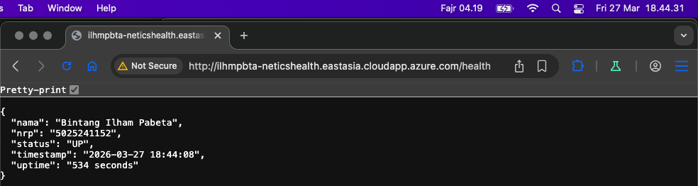
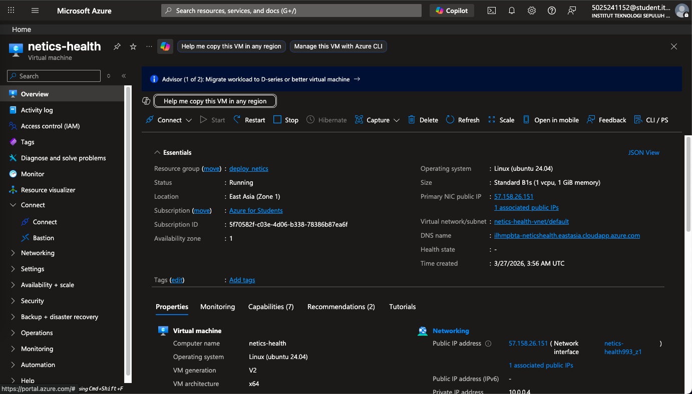

# netics-health

CI/CD API dengan endpoint `/health` untuk menampilkan informasi yang diminta pada [ketentuan penugasan 1](https://docs.google.com/document/d/11yzgwByWrnmcZ4dQC1MYS_dq12UrjpYHqdl0XIi9gVY/edit?tab=t.0#heading=h.t409mab8sybb) yang sudah diberikan.

### Penugasan Modul-1:Deployment Open Recruitment NETICS 2026

| NRP | Nama |
| --- | ---- |
| 5025241152 | Bintang Iham Pabeta |

> http://ilhmpbta-neticshealth.eastasia.cloudapp.azure.com/health 


### Teknis Pengerjaan

0. [VPS w/ Azure](#0-vps-w-azure)
1. [Membuat API publik dengan endpoint `/health`](#1-api-publik-health)
2. [Deploy API tersebut di dalam container pada VPS publik](#2-deploy-api-w-docker)
3. [Gunakan Ansible untuk instalasi dan konfigurasi nginx (full otomasi)](#3-otomasi-w-ansible)
4. [Lakukan CI/CD dengan GitHub Actions](#4-cicd-w-github-actions)

## 0. VPS w/ Azure

Pada kasus ini, kita melakukan deploy menggunakan Microsoft Azure



Instalasi dilakukan dengan bantuan panduan dari ilmu yang sudah saya terima selama LBE di repo [`ncclaboratory18/LBE-NCC-2025`](https://github.com/ncclaboratory18/LBE-NCC-2025)

### Persiapan

Beberapa langkah krusial yang dilakukan pada tahap awal sebelum masuk ke proses otomasi:

1. Instalasi Ansible via apt: Memilih instalasi melalui package manager bawaan OS (bukan pip) untuk kompatibilitas modul apt dan stabil saat berinteraksi dengan VPS Ubuntu.
    ```bash
    sudo apt install ansible
    ```

2. Docker Engine: Terinstal di mesin lokal (meskipun pada akhirnya proses build didelegasikan ke GitHub Actions) untuk keperluan testing container sebelum push ke repositori.
    ```bash
    sudo apt install docker.io
    sudo apt install python3-docker
    ```

3. Manajemen SSH Key: Jangan lupa untuk modifikasi permission file private key (`.pem`) menggunakan perintah ``chmod 600``.

4. Konfigurasi Azure Networking:

    - Membuka Port 22 (Inbound) untuk akses SSH/Ansible.
    - Membuka Port 80 (Inbound) agar Nginx dapat melayani akses publik.

5. Mengatur DNS Name Label pada Public IP Azure agar VPS dapat diakses melalui domain `*.cloudapp.azure.com` (agar tidak menggunakan ip mentah).

6. GitHub Secrets Configuration: Menyiapkan variabel rahasia pada repositori GitHub untuk menyimpan `SSH_KEY` (isi file `.pem`). Hal ini penting agar alur CI/CD dapat berkomunikasi dengan VPS secara aman tanpa mengekspos private key di Git.

## 1. API Publik `/health`

Kita diminta untuk membuat API publik dengan endpoint `/health` yang menampilkan informasi dalam bentuk json sebagai berikut (saya asumsikan json karena bentuknya seperti itu)

```json
{
  "nama": "Sersan Mirai Afrizal",   // Sesuaikan nama kita sendiri
  "nrp": "5025241999",              // Sesuaikan NRP kita sendiri
  "status": "UP",
  “timestamp”: time	                // Current time
  "uptime": time		            // Server uptime
}
```

Maka, implementasi yang paling mudah dapat kita lakukan dengan menggunakan python flask (sangat cocok untuk membuat REST API). Pseudocode implementasinya adalah sebagai berikut:

```py
from flask import Flask, jsonify
import time, timedelta, timezone

app = Flask(__name__)
START_TIME = time.time()

@app.route('/health')
def health():
    current_time = time.time()
    uptime_seconds = current_time - START_TIME
    
    return jsonify({
        "nama": "Sersan Mirai Afrizal",
        "nrp": "5025241999",
        "status": "UP",
        "timestamp": datetime.now(timezone(timedelta(hours=7))).strftime("%Y-%m-%d %H:%M:%S"),
        "uptime": f"{int(uptime_seconds)} seconds"
    })

if __name__ == '__main__':
    app.run(host='0.0.0.0', port=6767)
```

- Library flask, library untuk web hosting dari python, tujuannya untuk menjalankan sebuah web pada port `6767` (yes, 67 in the big 2026). Juga terdapat jsonify untuk menampilkan data dalam bentuk json.
- Library time, untuk menampilkan timestamp dan menghitung uptime. Juga terdapat timezone dan timedelta untuk mengubah base GMT/UTC menjadi WIB.

Itu adalah pseudocode dengan data Sersan favorit kita, implementasinya bisa dilihat pada [`app/app.py`](app/app.py). Saat endpoint `/health` dipanggil, hitung ``uptime = current time - START TIME.``

## 2. Deploy API w/ Docker

Untuk memastikan environment tetap konsisten, API dideploy menggunakan Docker. Implementasinya menggunakan base image Python yang ringan agar proses build dan pull lebih efisien.

```Dockerfile
FROM python:3.9-slim
WORKDIR /app
COPY app/ .
RUN pip install --no-cache-dir flask
EXPOSE 6767
CMD ["python", "app.py"]
```

- Base Image: [python:3.9-slim](https://hub.docker.com/layers/library/python/3.9-slim/images/sha256-b370e60efdfcc5fcb0a080c0905bbcbeb1060db3ce07c3ea0e830b0d4a17f758) dipilih karena image ringan (hanya puluhan MB).
- Run: pip install flask karena hanya itu satu-satunya dependency yang kita gunakan
- Port 6767: Diekspos sebagai port internal aplikasi.
- Registry: Image di-build dan disimpan di GitHub Container Registry (GHCR) dengan nama ghcr.io/ilhmpbta/api-health:latest.

## 3. Otomasi w/ Ansible

Otomasi server dilakukan menggunakan Ansible dengan pendekatan Infrastructure as Code (IaC). Kita tidak perlu melakukan SSH manual untuk instalasi aplikasi.

### Komponen Ansible:

- Inventory (inventory.ini): Menyimpan alamat IP VPS Azure dan user akses.
- Playbook (playbook.yml): Berisi tasks untuk:
    - Instalasi dependencies (Docker & Nginx).
    
        ```yml
        - name: Dependency check
        apt:
            name: 
            - python3-pip
            - python3-docker
            state: present
            update_cache: yes

        - name: Install Nginx
        apt:
            name: nginx
            state: present
            update_cache: yes
        ```

    - Melakukan pull image terbaru dari GHCR.

        Selain pull, kita pastikan playbook yang dibuat idempotent dengan menghapus instance docker dengan nama yang sama jika sudah ada.

        ```yml
        - name: Pull docker image
        docker_image:
            name: "ghcr.io/ilhmpbta/api-health:latest"
            source: pull
            force_source: yes

        - name: Delete duplicate instance
        docker_container:
            name: api-health
            state: absent
        ```

    - Menjalankan kontainer API dengan binding ke 127.0.0.1:6767 (agar API tidak bisa ditembak langsung dari luar).

        ```yml
        - name: Run API
        docker_container:
            name: api-health
            image: "ghcr.io/ilhmpbta/api-health:latest"
            state: started
            restart_policy: always
            published_ports:
            - "127.0.0.1:6767:6767"
        ```

    - Konfigurasi Nginx Reverse Proxy.
        
        ```yml
        - name: Deploy Nginx Config
        template:
            src: templates/nginx.conf.j2
            dest: /etc/nginx/sites-available/api_health
        notify: restart nginx
        ```

        Kita gunakan template Nginx dari file Jinja2 yang sudah kita siapkan [`templates/nginx.conf.j2`](templates/nginx.conf.j2)

- Template (templates/nginx.conf.j2): Menggunakan Jinja2 agar Nginx secara dinamis mengenali server_name sesuai IP VPS.
- Best Practice: API hanya mendengarkan localhost. Akses publik dikelola Nginx di port 80.


## 4. CI/CD w/ GitHub Actions

Seluruh alur kerja diotomatisasi menggunakan GitHub Actions. File konfigurasi dapat dilihat pada [`.github/workflows/deploy.yml`](.github/workflows/deploy.yml). Workflow ini terdiri dari dua Jobs utama yang berjalan sekuensial:

### Job 1: build-and-push

Job ini bertugas sebagai "kuli" untuk membangun image Docker. Keuntungannya, kita tidak perlu memiliki Docker terinstal di komputer lokal (sangat membantu jika menggunakan perangkat dengan resource terbatas atau OS lama).

- Login to GHCR: Menggunakan secrets.GITHUB_TOKEN bawaan GitHub untuk autentikasi ke registry.

- Build and Push: Menggunakan docker/build-push-action untuk mem-build Dockerfile dan mengirimnya ke registry.

    ```YAML
    build-and-push:
        runs-on: ubuntu-latest
        steps:
        - name: Build and Push
            uses: docker/build-push-action@v5
            with:
            context: .
            push: true
            tags: ghcr.io/${{ github.repository_owner }}/api-health:latest
    ```

### Job 2: deploy-to-vps

Job ini hanya akan berjalan jika build-and-push berhasil (needs: build-and-push). Di sini, GitHub Runner berubah menjadi "Orchestrator" yang memberikan instruksi ke VPS Azure melalui Ansible.

- Setup SSH Key: Mengambil isi file .pem dari secrets.SSH_KEY, menyimpannya ke file sementara ~/.ssh/id_rsa, dan mengatur izin akses (chmod 600).

- Ansible Override: Menjalankan ansible-playbook dengan --extra-vars untuk mengarahkan path SSH Key ke file sementara yang baru dibuat di dalam runner.

    ```Bash
    ansible-playbook -i inventory.ini playbook.yml \
        --extra-vars "ansible_ssh_private_key_file=~/.ssh/id_rsa" -vv
    ```

## Extras: Analisis & Best Practices
Dalam pengerjaan ini, diterapkan beberapa konsep penting untuk menjaga kualitas dan keamanan environment:

### Prinsip Idempotency

Ansible memastikan bahwa setiap task bersifat Idempotent. Artinya, jika kita menjalankan playbook berkali-kali, Ansible hanya akan melakukan perubahan jika kondisi server belum sesuai dengan yang didefinisikan. Contohnya:

- Jika kontainer api-health sudah berjalan dengan versi terbaru, Ansible tidak akan melakukan restart yang tidak perlu.
- Jika Nginx sudah terinstal, Ansible tidak akan mencoba menginstalnya kembali.

### Defense in Depth (Security)

Keamanan aplikasi tidak hanya mengandalkan Azure Network Security Group (NSG), tetapi juga pada level aplikasi:

- Internal Binding: Kontainer Docker di-bind ke 127.0.0.1:6767. Hal ini memastikan akses ke API wajib melalui Nginx. Serangan bypass langsung ke port API dari internet akan otomatis diblokir oleh sistem operasional server.

- Separation of Secrets: Tidak ada kredensial sensitif (IP, Username, SSH Key) yang di-hardcode di dalam repositori publik. Semuanya dikelola melalui GitHub Secrets.

### Infrastruktur sebagai Kode (IaC)

Dengan menyimpan konfigurasi Nginx dan alur deployment dalam bentuk kode (`.yml`, `.j2`, `.ini`), seluruh infrastruktur server dapat direplikasi secara instan jika sewaktu-waktu VM Azure perlu dihancurkan dan dibuat ulang (student-balance jumlahnya terbatas wak).

[back to top](#penugasan-modul-1deployment-open-recruitment-netics-2026)

---